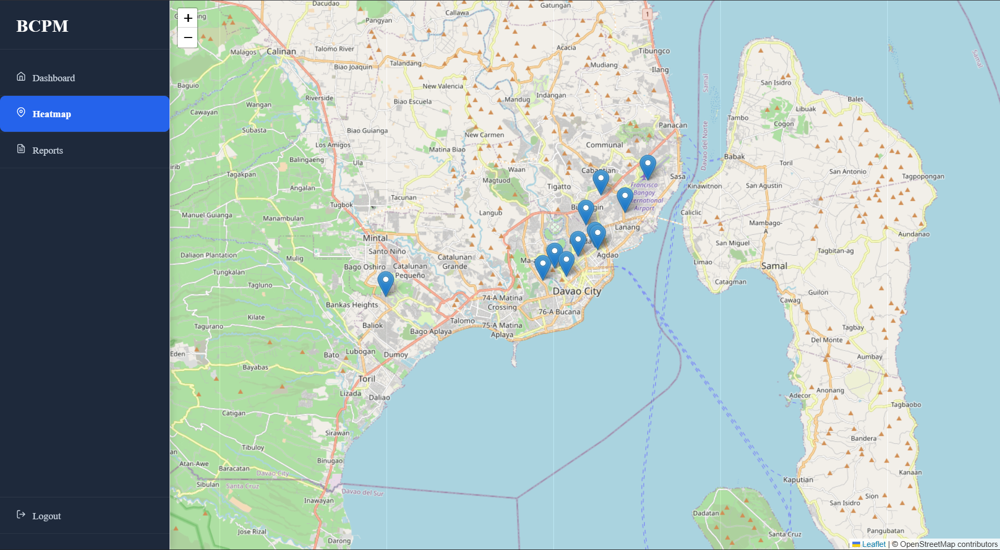

<div align="center">

# 🗺️ Barangay Community Problem Heatmap

**A web-based Geographic Information System (GIS) for monitoring, managing, and visualizing community problems within barangays.**


</div>

---

## 📖 About

The **Barangay Community Problem Heatmap** is a web application designed to help barangay officials monitor and respond to community-reported incidents through an interactive map and analytics dashboard.

Citizens or barangay personnel can report issues such as:

* 🌊 Floods
* 🗑️ Garbage Accumulation
* 🚔 Crime
* 🔥 Fire
* 🛣️ Road Damage
* 💧 Water Leakage
* 🚗 Illegal Parking

Each report is displayed on an interactive map using its geographic coordinates, allowing officials to identify problem hotspots and prioritize response efforts.

---

## ✨ Features

* 📍 Interactive map using OpenStreetMap
* 📝 Create, update, and delete reports
* 🏘️ Barangay management
* 📂 Problem category management
* 📊 Dashboard analytics
* 📈 Statistical charts
* 🔍 Search and filter reports
* 📌 Click on the map to select incident location
* 👥 User authentication
* 📱 Responsive admin dashboard

---

## 🎯 Objectives

* Improve monitoring of community incidents.
* Provide real-time visualization of reported problems.
* Help officials identify high-risk areas.
* Support data-driven decision making.
* Improve communication between citizens and barangay officials.

---

## 🛠️ Technology Stack

| Backend | Frontend   | Database | Others          |
| ------- | ---------- | -------- | --------------- |
| PHP     | React      | MySQL    | Laravel Sanctum |
| Laravel | JavaScript | JSON     | REST API        |
|         | HTML (JSX) |          | React Leaflet   |
|         | CSS        |          | OpenStreetMap   |

---

## 📷 System Preview

<p align="center">

</p>

---

## 🚀 Installation

### Clone the repository

```bash
git clone https://github.com/yourusername/barangay-community-problem-heatmap.git
```

### Go to the project directory

```bash
cd barangay-community-problem-heatmap
```

### Install Laravel dependencies

```bash
composer install
```

### Install React dependencies

```bash
npm install
```

### Configure the environment

```bash
cp .env.example .env
php artisan key:generate
```

Update your **.env** file with your MySQL database credentials.

### Run migrations and seeders

```bash
php artisan migrate --seed
```

### Start the backend

```bash
php artisan serve
```

### Start the frontend

```bash
npm run dev
```

---

## 📈 Future Improvements

* 🔥 Heatmap visualization
* 📧 Email notifications
* 📱 Mobile application
* 📷 Image upload support
* 📄 PDF and Excel export
* 🔔 Real-time notifications
* 📊 More advanced analytics
* 🌦️ Weather integration

---

## 👨‍💻 Author

Developed as a **Bachelor of Science in Information Technology (BSIT)** Personal Project.

---

<div align="center">

⭐ If you found this project useful, consider giving it a star!

</div>
